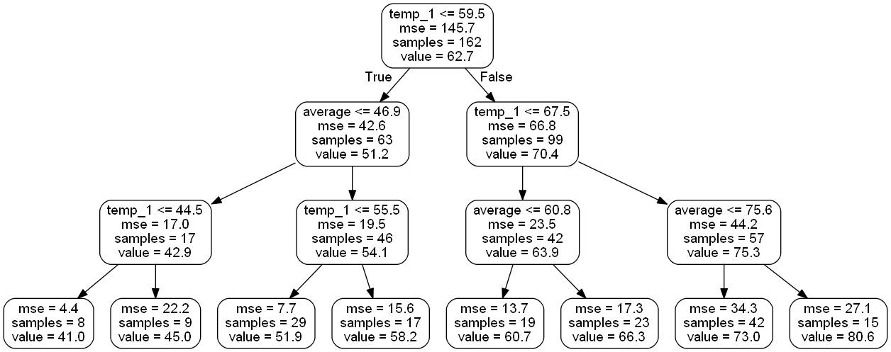

# Weather Prediction using Random Forest

### [View on Github](https://github.com/BisariaUtkarsh/Weather_Prediction)

The problem we tackle is predicting the max temperature for tomorrow in a city using one year of past weather data.
I am using Seattle, WA data using the NOAA Climate Data Online tool.

What we do have access to is - 
<ul>
  <li>One year of historical max temperatures</li>
  <li>Temperatures for the previous two days</li>
  <li>An estimate from a friend</li>
</ul>
<b>This is a supervised, regression machine learning problem.</b>

It’s supervised because
we have both the features (data for the city) and the targets (temperature) that we want to predict.
During training, we give the random forest both the features and targets and it must learn how to map the data to a prediction.
Moreover, this is a regression task because the target value is continuous (as opposed to discrete classes in classification). 
That’s pretty much all the background we need, so let’s start!

## Visualization of single Decision Tree of dataset
&nbsp; &nbsp; &nbsp; &nbsp; &nbsp; &nbsp; &nbsp; &nbsp; &nbsp;

